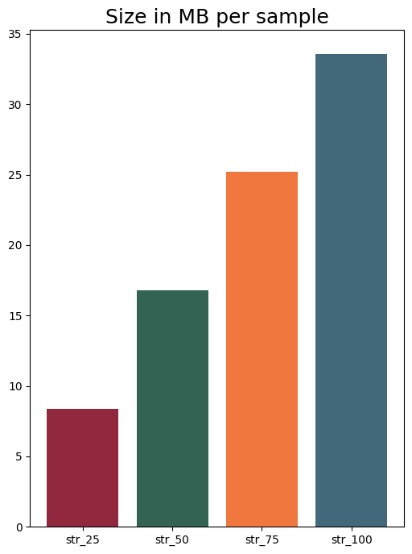
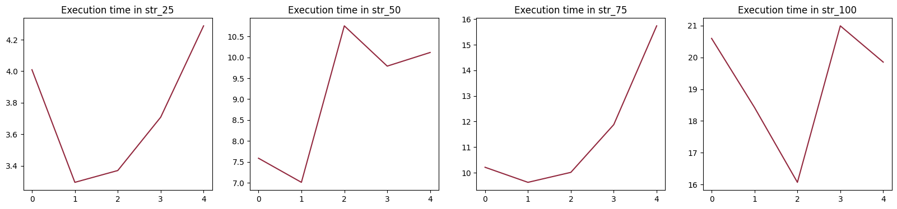
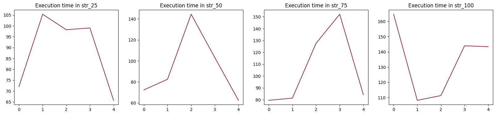
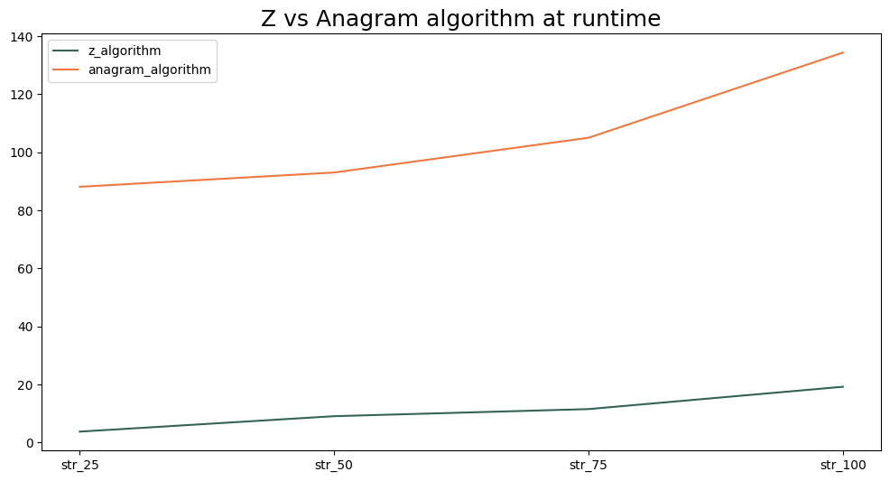

# String Searching Algorithms
In order to compare the efficiency of two string search algorithms, the objective is to measure the time it takes to search for a specific word in a text using both the `Z algorithm` and the `Anagram algorithm`.

## Installation
Just clone the repository and execute every cell in `start.ipynb`. Not forget to install all the dependencies.

## Results
For a more consistent comparison, four datasets of different sizes (specifically 8.40, 16.80, 25.19, and 33.59 MB) will be used. From each dataset, five random words will be extracted, and these will be used to measure the execution time of each algorithm.

The data used in this comparison were extrated from <a>https://www.kaggle.com/datasets/sunnysai12345/news-summary</a>.

     

### Z algorithm
Execution time (in seconds) for `Z Algorithm` per each word and dataset.
 

### Anagram Search
Execution time (in seconds) for `Anagram Search` per each word and dataset.
 

### Comparison
Average execution time (in seconds) per algorithm and dataset.
 
In conclusion, both algorithm have done a good job, but `Z algorithm` proves to be better than `Anagram Search` in terms of efficiently.
